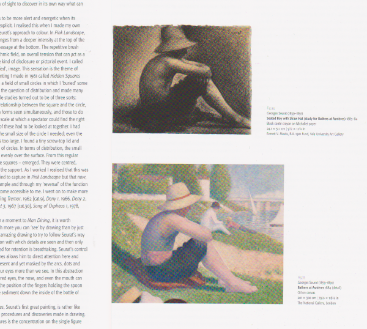

# Showing a region of the Canvas

import { GitHubDiscussion } from "../../GitHubDiscussion.js";
import region1 from '@site/sandboxes/05-regions/region1.csb/_load';
import region2 from '@site/sandboxes/05-regions/region2.csb/_load';
import region3 from '@site/sandboxes/05-regions/region3.csb/_load';
import region4 from '@site/sandboxes/05-regions/region4.csb/_load';
import region5 from '@site/sandboxes/05-regions/region5.csb/_load';
import region6 from '@site/sandboxes/05-regions/region6.csb/_load';
import more2 from '@site/sandboxes/07-more-regions/more2.csb/_load';
import more3 from '@site/sandboxes/07-more-regions/more3.csb/_load';
import { Sandbox } from '@site/Sandbox';


<div style={{ height: '240px', overflow: 'hidden', marginBottom: 30, position: 'relative' }}>
<image-service 
   height="240"
   preset="static" 
   src="https://iiif.wellcomecollection.org/image/b14658197.jp2" region="2449,1062,1695,965" />

</div>


Sometimes you want to render just a _part_ of an image (an `xywh` region).

This might be part of a Canvas, or a region of an image service. This can be specified with the `region` parameter, available on both `image-service` and `canvas-panel`:

If you just have an image service:

<Sandbox stacked project={region1} />

If you have a canvas ID, within a manifest:

<Sandbox stacked project={region2} />

Another variation is a content state that supplies the canvas, but doesn't supply a region:

<Sandbox stacked project={region3} />

And if that content state does supply the region itself, then it's all you would need:

<Sandbox stacked project={region4} />

([See this content state decoded](https://base64url.herokuapp.com/?iiif-content=JTdCJTIyaWQlMjIlM0ElMjJodHRwcyUzQSUyRiUyRmlpaWYud2VsbGNvbWVjb2xsZWN0aW9uLm9yZyUyRnByZXNlbnRhdGlvbiUyRmIxNDY1ODE5NyUyRmNhbnZhc2VzJTJGYjE0NjU4MTk3LmpwMiUyM3h5d2glM0QyNDQ5JTJDMTA2MiUyQzE2OTUlMkM5NjUlMjIlMkMlMjJ0eXBlJTIyJTNBJTIyQ2FudmFzJTIyJTJDJTIycGFydE9mJTIyJTNBJTVCJTdCJTIyaWQlMjIlM0ElMjJodHRwcyUzQSUyRiUyRmlpaWYud2VsbGNvbWVjb2xsZWN0aW9uLm9yZyUyRnByZXNlbnRhdGlvbiUyRmIxNDY1ODE5NyUyMiUyQyUyMnR5cGUlMjIlM0ElMjJNYW5pZmVzdCUyMiU3RCU1RCU3RA))


In the example immediately above, that content state expands to this:

```json
{
   "id":"https://iiif.wellcomecollection.org/presentation/b14658197/canvases/b14658197.jp2#xywh=2449,1062,1695,965",
   "type":"Canvas",
   "partOf":[
      {
         "id":"https://iiif.wellcomecollection.org/presentation/b14658197",
         "type":"Manifest"
      }
   ]
}
```

That is, region `2449,1062,1695,965`, on the canvas `https://iiif.wellcomecollection.org/presentation/b14658197/canvases/b14658197.jp2`, which is in the manifest `https://iiif.wellcomecollection.org/presentation/b14658197`. (This example taken from [Content State specification](https://iiif.io/api/content-state/1.0/#41-a-region-of-a-canvas-in-a-manifest)).

If the `preset` behaviour of canvas panel is set to `static` or `responsive`, you don't need any additional attributes. But if rendering as deep zoom (the default `render`), that implies you can zoom within the _viewport_ provided; but we might want to prevent you panning outside the initial _region_ (or might allow it, as required).

:::danger

The attribute that makes Canvas Panel restrict panning outside of the region (when in zoom mode) has not yet been implemented.

:::

:::info

If a full-screen mode is available and the user activates it: what fills the screen and what are the constraints on panning? For all render modes, if the `target` of that content state was a region of canvas (e.g., `..#xywh=900,900,1000,1000`), then it will initialise with that as a best-fit, which might show areas outside the region.

How to make the viewport go full screen?

Full screen is a user-land feature that could be added:

See [common viewer features page](../../docs/applications/simple-viewer-with-common-features) 

:::


## Setting regions programmatically


<Sandbox stacked project={region5} />


> Canvas Panel always shows _one_ canvas. That canvas is accessible via the Vault. However, that canvas might be a _synthetic_ canvas that the developer  dynamically and composited other canvases and content onto. Your app might be using a wrapping layout component around Canvas Panel, e.g., to layout a manifest as a strip (with zones) so you don't have to explicitly do the compositing.

## Introducing Targets

:::info

The simple version of a Target class shown here is supported by the current Canvas Panel.

We are working on a more sophisticated Target class (that could be be any spatial or temporal target on a Canvas).

:::

As well as setting region via an attribute, you can also set it in code. The `region` attribute is a 2D-specific simplification of a more general `Target` helper class. Here we are creating a Target instance ourselves to specify a part of the canvas.

<!--
(see [Target](../../docs/components/cp) in the Canvas Panel Type documentation)
```js
const tgt = new Target();
tgt.spatial.x = 2000;
tgt.spatial.y = 1200;
tgt.spatial.w = 456;
tgt.spatial.h = 987;
```


You can also construct a target from the `xywh` string format commonly found in annotations:
```js
const tgt = new Target("xywh=2000,1200,456,987"); // same thing as above
```
 -->

```js
const myTarget = { x: 0, y: 0, width: 100, height: 100 };
cp.goToTarget(myTarget);

const myTarget2 = { x: 2000, y: 2000, width: 2000, height: 1500 }
const myOptions = { padding: 20, nudge: true, immediate: true } 
cp.goToTarget(myTarget2, myOptions);
```

The following is not yet supported:

```js
const myTarget2 = { x: 2000, y: 2000, width: 2000, height: 1500 }
const myOptions = { 
   padding: 20, 
   nudge: true,
   transition: "transform 500ms ease-out" 
} 
cp.goToTarget(myTarget, myOptions);
// The syntax of transition is the same as CSS transition
// https://developer.mozilla.org/en-US/docs/Web/CSS/transition
```

You can also remove the target, and there is a built-in _home_ target, to return canvas panel to its initial state (returning to the viewport as it was initially, before panning and zooming):

```js
cp.clearTarget();
cp.goHome();
```


<Sandbox stacked project={region6} />


For more on developing Annotation functionality, displaying annotations, and working with bodies and targets, see [Annotations](./annotations).

## More with regions



This image shows the sort of widget that might be used in a content management system, where the editor can select either a whole image (the top one) or a detail of a larger image (the bottom one), and accompany that image with some additional HTML.

This is an example of using Canvas Panel as a component of _some other piece of software_ - Canvas Panel itself doesn't render the additional markup - that's the component you write. Canvas Panel takes care of rendering a canvas, or some part of a canvas.

### Using content state

In the following, `https://iiif-canvas-panel.netlify.app/extra-fixtures/boy-with-straw-hat.json` is a content state at a URL. This will have been made by an editor at content-creation time, using a [Content State Selector](../../docs/applications/content-state-selector). It's a full JSON content state that looks like this:

```json
{
  "type": "Annotation",
  "motivation": ["contentState"],
  "target": {
    "id": "https://iiifmediawiki.herokuapp.com/presentation/canvas/c208117.json#xywh=50,990,2100,1755",
    "type": "Canvas",
    "partOf": [
      {
        "id": "https://iiifmediawiki.herokuapp.com/presentation/File:Baigneurs_a_Asnieres.jpg",
        "type": "Manifest"
      }
    ]
  }
}
```

The content-management template author will then produce code that will output something like this:

```html
<div class="canvas-figure">
    <canvas-panel 
          preset="responsive"
          iiif-content="https://iiif-canvas-panel.netlify.app/extra-fixtures/boy-with-straw-hat.json"
           />
    <p class="figure-text">
       Fig. 75<br/>
       Georges Seurat (1859-1891)
       <strong>Bathers at Asnières 1884 (detail)</strong><br/>
       <em>Oil on Canvas</em><br/>
       24.1 × 31.1 cm (9 1/2 × 12 1/4 in.)<br/>
       The National Gallery, London<br/>
    </p>
</div>
```

That is, the content-managed data for this widget is the figure text, and a content state pointing to the relevant part of an IIIF resource.

As the template author has the content state handy, they can use it to create a link to another page that would let the user explore the painting in mode detail (but still initialised on the boy-with-straw-hat detail):

```html
<a href="https://getty.edu/iiif-viewer?iiif-content=https://iiif-canvas-panel.netlify.app/extra-fixtures/boy-with-straw-hat.json">View this painting</a>
```

or, make the canvas panel image the link:

```html
<a href="https://getty.edu/iiif-viewer?iiif-content=https://iiif-canvas-panel.netlify.app/extra-fixtures/boy-with-straw-hat.json">
    <canvas-panel 
          preset="responsive"
          width="300"
          iiif-content="https://iiif-canvas-panel.netlify.app/extra-fixtures/boy-with-straw-hat.json"
           />
</a>
```

<Sandbox stacked project={more2} />


### Not using content state

An alternative would be where the developer has the region and IIIF information to hand directly, in which case they don't need a stored content state, or they are using the info from the content state directly:

<Sandbox stacked project={more3} />


<GitHubDiscussion ghid="5" />