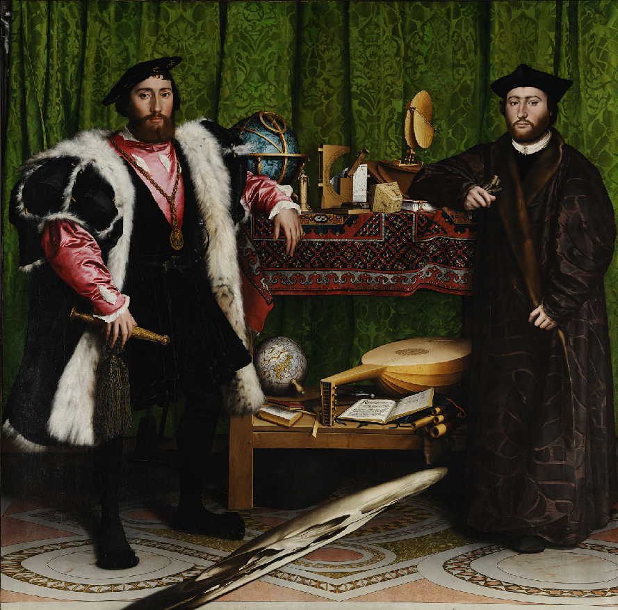
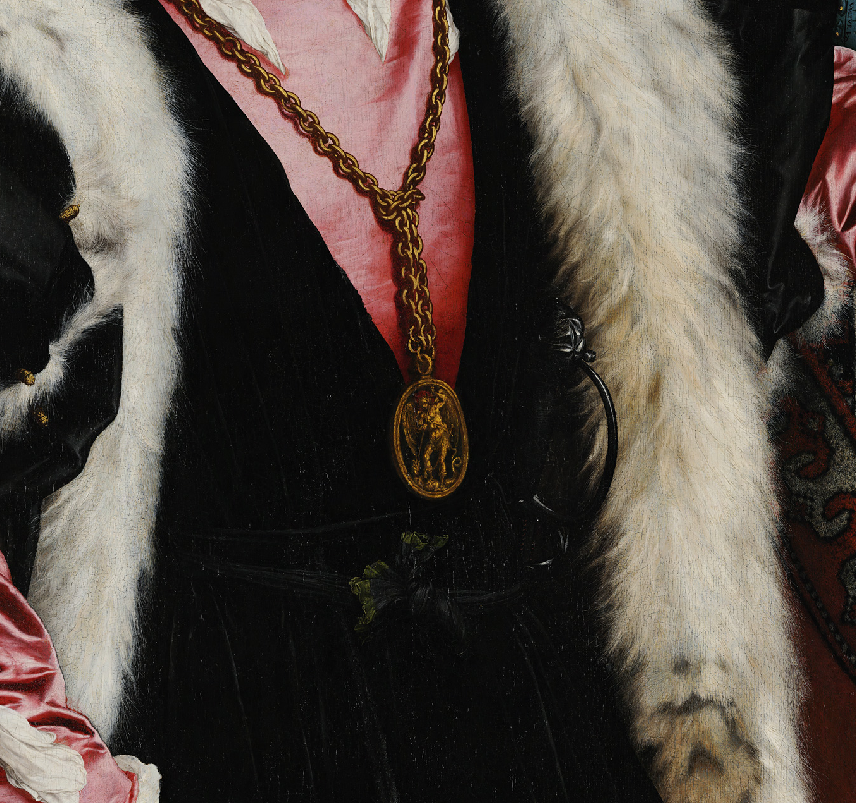
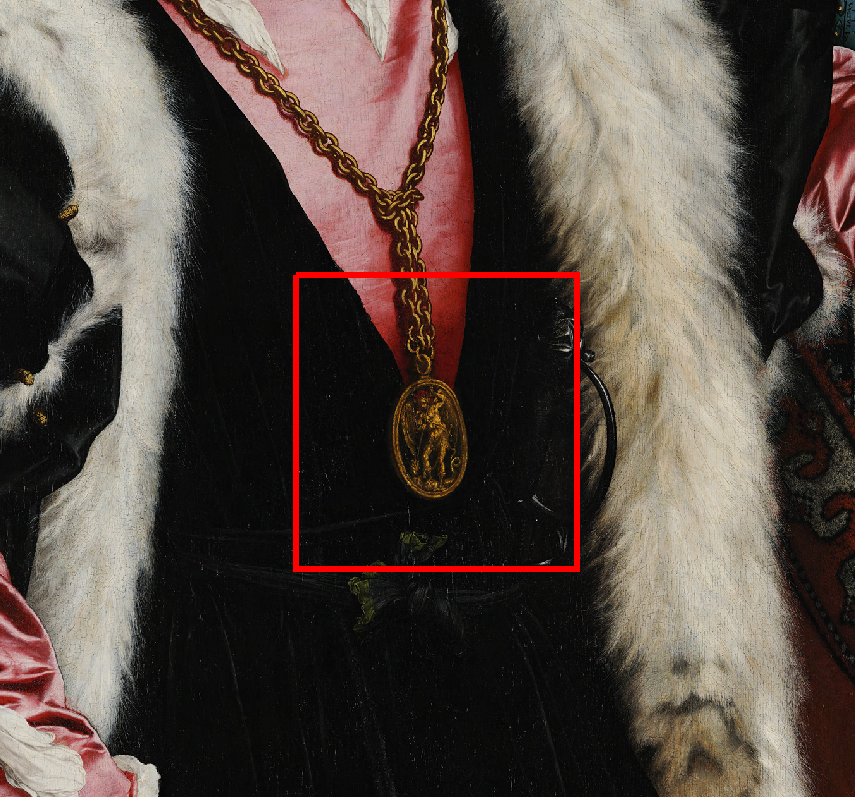
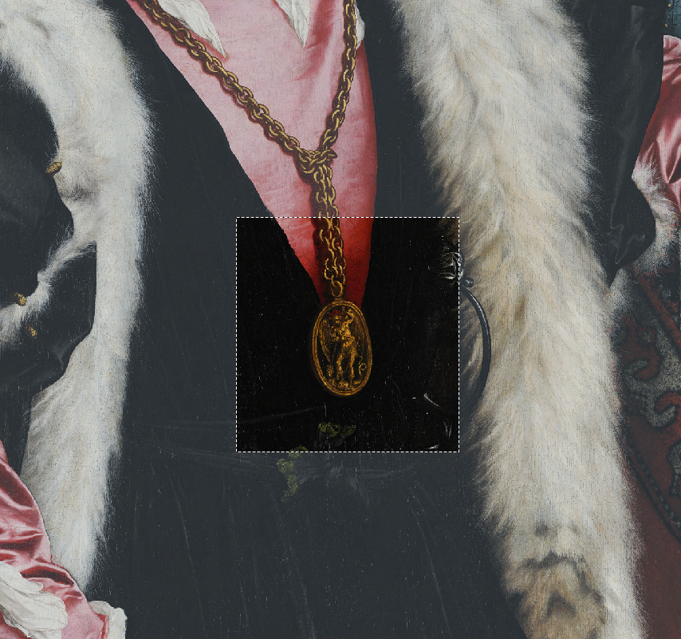

# Drawing boxes - and drawing attention

import { GitHubDiscussion } from "../../GitHubDiscussion.js";


:::caution

TODO: need to get a valid source for The Ambassadors or use a different image


TODO:
Work in https://codesandbox.io/s/frosty-bush-48h9t?file=/index.html

:::

## Scenario

You want to highlight a region of the Canvas, and style the way you highlight it. You might have already initially constrained the viewport to a particular part of the canvas (as in [Regions](./regions)).

Consider Canvas Panel showing a painting:

```html
<canvas-panel
   iiif-content=https://data.ng-london.org.uk/iiif/0CWR-0001-0000-0000/canvas/-1
   partof=https://data.ng-london.org.uk/iiif/0CWR-0001-0000-0000/manifest
/>
```


Then showing a detail via the addition of a `region` attribute:

```html
<canvas-panel
   iiif-content=https://data.ng-london.org.uk/iiif/0CWR-0001-0000-0000/canvas/-1
   partof=https://data.ng-london.org.uk/iiif/0CWR-0001-0000-0000/manifest
   region="2000,2000,1000,1000"
/>
```



Then **highlighting something** within that detail:

<!-- TODO: GH-70, GH-93, GH-94 -->
```html
<canvas-panel
   iiif-content=https://data.ng-london.org.uk/iiif/0CWR-0001-0000-0000/canvas/-1
   partof=https://data.ng-london.org.uk/iiif/0CWR-0001-0000-0000/manifest
   region="2000,2000,1000,1000"
   highlight="2400,2400,400,400"
   highlight-css-class="red-box"
/>
```



And using different styles:

```html
<canvas-panel class="knock-back"
   iiif-content=https://data.ng-london.org.uk/iiif/0CWR-0001-0000-0000/canvas/-1
   partof=https://data.ng-london.org.uk/iiif/0CWR-0001-0000-0000/manifest
   region="2000,2000,1000,1000"
   highlight="2400,2400,400,400"
   highlight-css-class="dash"
/>
```



The CSS classes are not part of Canvas Panel, they are in your styles under your control.

In the above examples, the `region` and `highlight` attributes both take string values that can be transformed to [Target](./annotations#target) objects. `highlight` is a convenience attribute, with a convenience css assistant; in code you are doing something more general - you are adding an annotation to the canvas that appears as a highlight. This is such a common scenario that it still has a helper:

<!-- TODO: GH-70, GH-93, GH-94 -->
```html
<canvas-panel id="cp"></canvas-panel>
<script>
   const vault = new Vault();
   const cp = document.getElementById("cp");
   await vault.loadManifest("..manifest_id..");
   cp.setCanvas("..canvas_id..");

   // set the viewport to a region:
   // With no additional arguments, there is no animation
   cp.goToTarget(new Target("xywh=2000,2000,1000,1000"));

   // draw a box in this region (the verbose way, for comparison, but could be short form):
   const redBoxTarget = new Target();
   redBoxTarget.spatial.x = 2400;
   redBoxTarget.spatial.y = 2400;
   redBoxTarget.spatial.w = 400;
   redBoxTarget.spatial.h = 400;
  
   // create an annotation with motivation "highlighting"
   const anno = new HighlightingAnnotation();
   anno.target = redBoxTarget;
  
  // here I could ask for anno.toW3CAnno() and get a pure W3C JSON
  
   // create anno in vault
   vault.load("my-anno", anno);

   const displayAnno = new DisplayAnnotation(vault.FromRef("my-anno"));
   displayAnno.cssClass = "red-box";
       
   cp.DisplayAnnotations.add(displayAnno); // TBC, see Issue #94
</script> 
```


The highlight region might also be defined by SVG.

## TODO

Need work this demo in:

https://codesandbox.io/s/canvas-panel-web-component-demo-forked-nj46y?file=/index.html

```html
<canvas-panel
  preset="zoom"
  iiif-content='{"id": "https://data.ng-london.org.uk/iiif/0CWR-0001-0000-0000/canvas/116#1000,1500,1500,1000", "type": "Canvas", "partOf": "https://data.ng-london.org.uk/iiif/0CWR-0001-0000-0000/manifest"}'
  highlight="1250,1780,400,400"
  highlight-css-class="example-annotation"
  style-id="my-style"
/>
```


<GitHubDiscussion ghid="12" />