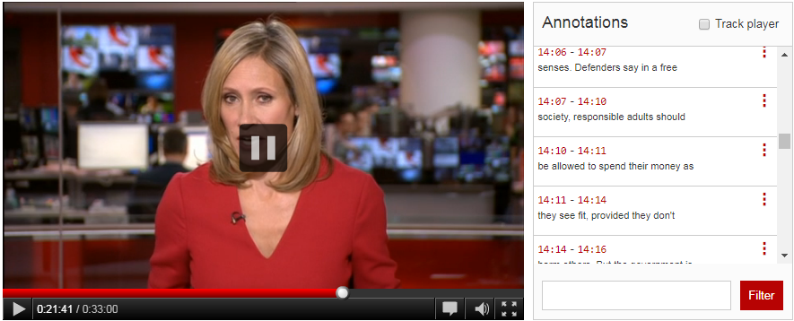

<!-- TODO: GH-81 -->
# Handling Text

import { GitHubDiscussion } from "../../GitHubDiscussion.js";


How do I get the text from the canvas so I can do things with it in other parts of my application?
How do I let the user select text on the Canvas surface?

Text is one area where for practical reasons the component supports more that just IIIF and W3C.
For spatial content, the OCR formats METS-ALTO and hOCR should also be supported.
For temporal content, WebVTT should be supported.
In both cases the content in these formats can be translated into something that targets the canvas the same way W3C annos do.

<!-- TODO: GH-109 -->
## Text rendering _outside_ the canvas

See https://canvas-panel.digirati.com/developer-stories/viewer1.html

I want to obtain the text that's currently on the canvas and render it somewhere else.
I also want to be able to respond to interactions with that text and reflect it on the canvas surface.

A simple example of this is [Drawing boxes](./drawing-boxes), but for text annotations. Consider this view in (regular) Mirador 3:


Suppose the left hand main panel is Canvas Panel. 
There are three kinds of interaction going on here. 
1. Because I have the anno panel open, as I move my mouse around on the canvas, a purple box is drawn around the anno at that location on the canvas. Nothing happens in the right hand anno panel.
2. As I move my mouse around the anno panel, the purple box on the canvas continues to highlight the relevant annotation, moving around the canvas surface (there are no visual changes to the anno panel).
3. If I click an anno in the anno panel, it highlights it in grey in the anno panel and draws a yellow box around the anno target on the canvas.

An almost equivalent for AV content would look like this:



This is a common scenario and the interactions between text in annotations have been captured in a separate component that in both scenarios above you would use like this:

```html
<canvas-panel
   id="cp"
   iiif-content="https://..canvas_id.."
   partof="https://..manifest_id.."
   text-enabled="true">
</canvas-panel>

<text-lines canvas-panel="cp">
</text-lines>
```

See [Text-lines](../../docs/components/text-lines) for a description of how this is implemented.

This component produces outputs for video and audio with captions as annotations, video and audio with captions as WebVTT, images of text with line transcription `supplementing` annotations (it looks for and favours the `line` text granularity).

If more than one source of supplementing annos is available, or pseudo-annotations (OCR data or WebVTT), the `<text-lines>` component shows a drop down at the top that allows the user to choose, using labels and languages.

The annotation listing component doesn't behave differently for hover, select, scroll; any of these events has a corresponding annotation as data (the annotation clicked on or scrolled to); the glue code navigates to and/or highlights the corresponding annotation target. This might be a navigation in _time_.

<!-- TODO: GH-81 -->
## Text rendering _on_ the canvas

This is described in https://canvas-panel.digirati.com/developer-stories/collaboration.html, but there is a real implementation of this now - https://github.com/dbmdz/mirador-textoverlay - which works very well and solves many subtle interaction issues.

I want the user to be able to select text from the canvas, copy it to clipboard.

Canvas panel treats `supplementing` annotations differently from other textual annotations. And it treats METS-ALTO and hOCR files linked via annotation or `seeAlso`, and WebVTT, _as if they were annotations_.


```html
<canvas-panel
   iiif-content="https://..canvas_id.."
   partof="https://..manifest_id.."
   text-enabled="true"
   text-selection-enabled="true">
</canvas-panel>

<div id="textyStuff" style="display:none">
 Text selection: <button id="textToggle">On</button>
 <br/>
 <button id="textState">Show</button>
</div>

<script>
   const cp = document.getElementById("cp"); ​

  ​// (whatever the pattern for this is)
  ​cp.addEventListener("ready", () => { 
     ​ if(cp.hasText) {  
         document.getElementById("textyStuff").style.display = "";
         const toggler = document.getElementById("textToggle"); 
         const textState = document.getElementById("textState"); 
         toggler.addEventListener("click", () => {
             cp.textSelectionEnabled = !cp.textSelectionEnabled;
             toggler.innerText = cp.textSelectionEnabled ? "On" : "Off";
         });
         textState.addEventListener("click", () => {
            console.log(cp.text); // { .. } an object giving access to various properties of the text
            
            // all the supplementing annotations that were used to generate the /text object.
            console.log(cp.text.supplementingAnnotations); 
            console.log(cp.text.text);  // as text/plain
            console.log(cp.text.html);  // with some mild markup - (maybe only <br/>?)
            console.log(cp.text.selection.text);  // same but the current user selection
            console.log(cp.text.selection.html);
            console.log(cp.text.selection.supplementingAnnotations); // just those in the current selection
         });
      }
  ​});

</script>
```

By default (as with the Mirador plugin) Canvas Panel will favour OCR formats over W3C Annotations, if it finds links to both. This is because in practice the W3C annotations are very likely to have been generated from the OCR formats in the first place.

This behaviour can be overridden. (samples).


<GitHubDiscussion ghid="15" />


